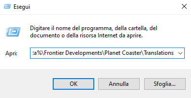
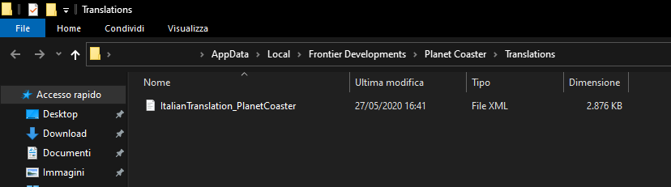
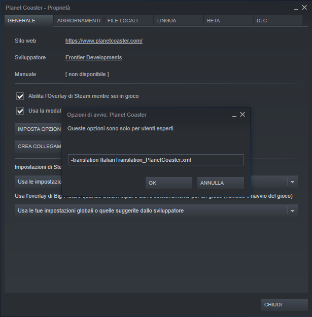

# Planet Coaster - Traduzione Italiana
Traduzione Italiana per Planet Coaster - [Sito Web](https://traduzioneplanetcoaster.altervista.org/) - [Domande Frequenti](https://traduzioneplanetcoaster.altervista.org/italiano/faq/)

## Indice

- [Requisiti](#requisiti)
- [Istruzioni per l'installazione](#istruzioni-per-linstallazione)
- [Risultato finale atteso](#risultato-finale-atteso)
- [Come scarico la traduzione da questo strano sito?](#come-scarico-la-traduzione-da-questo-strano-sito)
- [Come mai la traduzione non è completa / è aggiornata poco?](#come-mai-la-traduzione-non-è-completa--è-aggiornata-poco)
- [Ho trovato degli errori nella traduzione / Voglio aiutarvi!](#ho-trovato-degli-errori-nella-traduzione--voglio-aiutarvi)
- [Autori Principali](#autori-principali)
- [Ringraziamenti speciali](#ringraziamenti-speciali)

## Requisiti

Una copia ufficiale di Planet Coaster su Steam e Windows.

La traduzione **non funziona** con copie non ufficiali, su MacOS o su Console.

## Istruzioni per l'installazione

1. Apri "Esegui" (premendo insieme il tasto Windows + R sulla tastiera, o cercandolo nel menu Start);
2. Immetti il percorso `%localappdata%\Frontier Developments\Planet Coaster\Translations`;

3. Premendo invio si dovrebbe aprire la cartella in cui mettere il file .XML, chiamato *ItalianTranslation_PlanetCoaster.xml*. **(devi aver avviato il gioco almeno una volta per trovare questa cartella)**;
4. Apri Steam, vai nella tua libreria e fai tasto destro su Planet Coaster. Ora clicca Proprietà e in seguito cerca la casella in basso "Opzioni di avvio";
5. Nella casella scrivi:`-translation ItalianTranslation_PlanetCoaster.xml`, poi premi Ok;
6. Fatto, ora dovresti avere il gioco in italiano, se hai avuto difficoltà contattaci su [Facebook](https://www.facebook.com/PlanetCoasterInItaliano/) o [per email](mailto:traduzioneplanetcoaster@altervista.org?subject=Traduzione%20Planet%20Coaster).

(**NB:** Ricorda che i file vanno nella cartella `...\Planet Coaster\Translations`, non creare sottocartelle in "Translations" con dentro i file o la traduzione non funzionerà.)

## Risultato finale atteso

Il risultato finale perché la traduzione funzioni correttamente, dovrebbe essere questo:

## Come scarico la traduzione da questo strano sito?

- Il primo metodo è premere il bottone verde in alto a destra "Clone or Download" e scegliere "Download Zip", questo vi scaricherà un archivio zip contenente il file .xml della traduzione che dovete estrarre e inserire nella cartella come spiegato sopra.

- Il secondo metodo **(più semplice)** è andare nella pagina ["Releases"](https://github.com/ScrappyCocco/PlanetCoasterItalian/releases) e scaricare l'ultima versione rilasciata.

Ps: ricorda tuttavia che utilizzando il secondo metodo la traduzione potrebbe non essere la più recente, in quanto rilasceremo una nuova versione nella pagina "Releases" solo dopo varie modifiche al file. Utilizzando il primo metodo invece scaricherai il file più recente.

## Come mai la traduzione non è completa / è aggiornata poco?

É passato tanto tempo da quando Planet Coaster è uscito su PC, e purtroppo gli impegni di noi traduttori sono cambiati molto, mentre il file di traduzione è diventato sempre più grande.

Questo ha comportato un rallentamento dei lavori fino a farli quasi fermare del tutto, di conseguenza la traduzione non è completa e potrebbe presentare molti errori, vi chiedo umilmente scusa.

Se qualcuno vuole contribuire, sarà sempre il benvenuto.

## Ho trovato degli errori nella traduzione / Voglio aiutarvi!

Nessun problema, l'abbiamo messa su GitHub apposta, qui tutti possono contribuire, registrati a GitHub ed effettua uno di questi due passaggi:

- Crea un "Issue" nel caso tu voglia segnalare errori nella traduzione - [qui](https://github.com/ScrappyCocco/PlanetCoasterItalian/issues).
- Crea una "Pull request" nel caso tu voglia contribuire attivamente alla traduzione - [qui](https://github.com/ScrappyCocco/PlanetCoasterItalian/pulls).

**Per creare una "Pull request"** devi prima fare il **"fork"**(Pulsante in alto a destra). Una volta completato il "fork" effettua tutte le modifiche che desideri nel **tuo** repository e infine mandaci la Pull request (New Pull request > compare across forks).
Puoi controllare gli errori al file di traduzione utilizzando [questo software](http://cdn.gulpeyrex.com/communitytranslations/tools/communitytranslationverifier/publish.htm) (Realizzato da Frontier).

**Non vuoi registrarti o non hai idea di come funzioni GitHub?**
Nessun problema, mandaci le tue modifiche su [Facebook](https://www.facebook.com/PlanetCoasterInItaliano/), provvederemo noi ad inserirle.

(Se non hai Facebook puoi anche mandarci una e-mail  [cliccando qui](mailto:traduzioneplanetcoaster@altervista.org?subject=Traduzione%20Planet%20Coaster).)

## Autori Principali

- Crybio
- ScrappyCocco
- SiegfriedM
- [Vedi altri](https://github.com/ScrappyCocco/PlanetCoasterItalian/graphs/contributors)

## Ringraziamenti speciali

- RaydenMK
